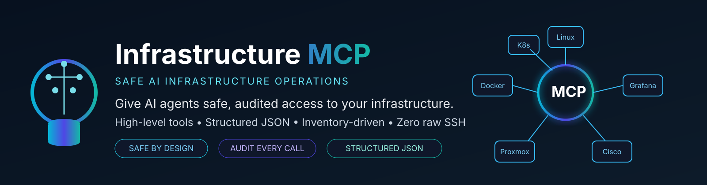

<p align="center">
  
</p>

# Infrastructure MCP Server

**Give Claude Code, Cursor, and other AI agents safe access to your real infrastructure — without giving them raw SSH access.**

A self-hosted [Model Context Protocol](https://modelcontextprotocol.io) server that exposes high-level, auditable tools (`disk_usage()`, `docker_restart()`, `grafana_alerts()`, ...) instead of `execute(command)`. Every call is inventory-driven, structured, and logged — the agent reasons about infrastructure; this server is the only thing that actually touches it.

> **Status:** early, actively developed. See [Roadmap](#roadmap) for what's implemented and what's coming.

**Manage:** ✓ Linux &nbsp; ✓ Docker &nbsp; ✓ Kubernetes &nbsp; ✓ Proxmox &nbsp; ✓ Grafana &nbsp; ✓ Cisco
*(MikroTik, UniFi, Prometheus/Loki, Home Assistant, and more are on the [Roadmap](#roadmap) — not shipped yet.)*

**Works with:** ✓ Claude Code &nbsp; ✓ Cursor &nbsp; ✓ OpenAI Codex &nbsp; ✓ Gemini CLI &nbsp; ✓ Windsurf &nbsp; ✓ Hermes
*(MCP is an open, client-agnostic protocol — any spec-compliant client works; these are just the ones people actually use it with.)*

| | Raw SSH access | Infrastructure MCP |
|---|---|---|
| Audit trail | ❌ | ✅ structured log per call (`tool`, `user`, `target`, `duration`, `result`) |
| Input validation | ❌ | ✅ every parameter validated, no shell interpolation |
| Structured output | ❌ free text | ✅ JSON, every response |
| Inventory-aware | ❌ agent picks the host | ✅ targets resolved by name/tag only |
| Blast-radius control | ❌ | ✅ read-only by default, mutations require `confirm: true` |
| Credential exposure | ❌ agent sees them | ✅ credentials never leave the adapter layer |

---

## Quick Start

```bash
git clone https://github.com/radumalica/infrastructure-mcp.git
cd infrastructure-mcp
go build -o bin/infrastructure-mcp ./cmd/server

cp configs/inventory.example.yaml configs/inventory.yaml   # fill in your own targets
```

Point your MCP client at the binary — see [Connecting an AI Agent](#connecting-an-ai-agent) for Docker and remote-HTTP setups too:

```json
{
  "mcpServers": {
    "infrastructure": {
      "command": "/path/to/bin/infrastructure-mcp",
      "args": ["-inventory", "/path/to/configs/inventory.yaml"]
    }
  }
}
```

---

## Example Conversation

```
You: My archive server feels slow, and I'm seeing errors in Grafana. Can you find out why?

Claude, using Infrastructure MCP:

  1. cpu_usage(server: "archive")                          → 92% used, status: "warning"
  2. docker_ps(server: "archive")                           → prometheus: "Restarting (1) 4 seconds ago"
  3. docker_logs(server: "archive", container: "prometheus") → "panic: too many open files"
  4. grafana_alerts(instance: "main")                        → firing: HighDiskUsage on archive:/

Claude: Root cause found — archive is at 91% disk usage, which is causing Prometheus
to crash-loop on startup ("too many open files" from a corrupted WAL it can't
compact into the remaining space). Free up space on `/` (or expand it), then run:

  docker_restart(server: "archive", container: "prometheus", confirm: true)
```

Four tool calls, one root cause, zero raw shell access. Every call above is inventory-driven, logged, and returns structured JSON — see [Examples](#examples) for the actual response shapes.

---

## Current Features

Tools implemented and tested against the real MCP protocol so far:

**Core (v0.1)**
- `list_servers` — list inventory targets, optionally filtered by tag
- `run_command` — run an arbitrary command against an inventory target
- `uptime` — uptime and load averages
- `disk_usage` — per-filesystem usage with warning/critical severity
- `memory_usage` — memory utilization with warning/critical severity

**Linux (v0.2)**
- `failed_services` — systemd units in the failed state
- `cpu_usage` — aggregate CPU utilization (Proxmox/KVM guest-time aware)
- `reboot_required` — pending-reboot detection (marker file + kernel comparison)
- `running_processes` — top processes by CPU usage
- `journal_errors` — recent systemd journal entries at error priority+
- `kernel_version` — running kernel release

**Docker (v0.3)**
- `docker_ps` — list containers (running or all)
- `docker_images` — list local images
- `docker_stats` — point-in-time resource usage snapshot
- `docker_logs` — recent combined stdout/stderr log lines
- `docker_restart` — restart a container (destructive; requires `confirm: true`)
- `docker_exec` — run a command inside a running container, the container-scoped equivalent of `run_command`

**Kubernetes (v0.4)**
- `kubectl_get_pods` — list pods, optionally scoped to a namespace
- `kubectl_logs` — fetch a pod/container's log lines
- `kubectl_events` — recent cluster events, most recent first
- `kubectl_describe` — structured pod summary (spec/status highlights + recent events)
- `kubectl_nodes` — node list with readiness, roles, and capacity
- `kubectl_exec` — run a command inside a pod's container, the pod-scoped equivalent of `run_command`/`docker_exec`

**Grafana (v0.5)**
- `grafana_alerts` — currently firing/resolved alert instances from the alerting API
- `grafana_dashboards` — search dashboards by title text and/or tag
- `grafana_annotations` — annotations, optionally scoped to a time range and/or tags
- `grafana_query` — raw query against one datasource (PromQL/LogQL/SQL/...); response is a datasource-specific passthrough, not normalized

**Proxmox (v0.6)**
- `proxmox_nodes` — list cluster nodes with status and resource usage
- `proxmox_vms` — list QEMU VMs and LXC containers on a node
- `proxmox_tasks` — recent tasks on a node, most recent first
- `proxmox_start_vm` — start a VM/container (state-changing; requires `confirm: true`)
- `proxmox_stop_vm` — force-stop a VM/container (destructive; requires `confirm: true`)
- `proxmox_snapshot` — take a VM/container snapshot (state-changing; requires `confirm: true`)

**Networking — Cisco (v0.7, partial: MikroTik/UniFi remain on the Roadmap)**
- `cisco_backup` — fetch the running configuration, as-is
- `cisco_version` — software version, hostname, and uptime
- `cisco_interfaces` — interface list with IP address, admin/link status, and line protocol
- `cisco_inventory` — hardware components (chassis, modules, PSUs) with PID/VID/serial number
- `cisco_logs` — buffered syslog messages, optionally capped to the most recent N lines
- `cisco_backup_diff` — fetch the running config and diff it against the last snapshot taken by this tool, flagging config drift

**Cross-cutting, since v0.1**
- Legacy network device support: Telnet transport, SSH legacy-crypto negotiation, transparent per-target protocol dispatch, SSH public-key auth for routers/switches
- Structured error contract on every tool (`message`, `recommendation`, `retryable`, `category`)
- Structured per-execution logging (`tool`, `user`, `target`, `duration`, `result`, `error`)
- Host-key verification fail-closed by default, with explicit opt-outs for lab use
- Dual MCP transport: stdio (local subprocess clients) and Streamable HTTP (remote clients), from the same binary — HTTP is fail-closed by default, requiring a bearer token (`MCP_HTTP_TOKEN`) unless explicitly opted out for lab use
- Docker image (multi-arch, GHCR) + Docker Compose, with a self-check `-healthcheck` mode for shell-less containers
- CI/CD: PR-gated build/vet/lint/race-tested-CI, automatic semantic versioning + changelog + image publish + Trivy scan on merge to `main` — see [CI/CD](#cicd)

See [Roadmap](#roadmap) for what's next.

---

## Table of Contents

- [Why](#why)
- [Goals](#goals)
- [Non-Goals](#non-goals)
- [Architecture](#architecture)
- [Installation](#installation)
- [Configuration](#configuration)
- [Connecting an AI Agent](#connecting-an-ai-agent)
- [Examples](#examples)
- [Tool Design Philosophy](#tool-design-philosophy)
- [Security](#security)
- [Development](#development)
- [CI/CD](#cicd)
- [Roadmap](#roadmap)
- [Contributing](#contributing)
- [License](#license)
- [A Note on How This Project Is Built](#a-note-on-how-this-project-is-built)

---

## Why

AI agents are increasingly asked to help operate infrastructure — check disk space, restart a container, look at recent errors. The naive way to enable this is to hand the agent raw SSH/shell access. That's fast to build and dangerous to run: no audit trail, no input validation, no blast-radius control, and every agent has to independently learn how to safely operate every kind of system.

Infrastructure MCP Server is the alternative: a single, self-hosted service that exposes **meaningful, structured, inventory-driven tools** (`disk_usage()`, `docker_restart()`, `grafana_alerts()`) instead of `execute(command)`. Agents reason about infrastructure; this server is the only thing that actually touches it.

## Goals

- Self-hosted
- Production-ready
- Secure by default
- Extensible
- Vendor agnostic
- Infrastructure as Code friendly
- Stateless where possible
- Structured outputs only
- Human-auditable
- Open Source

## Non-Goals

The project is **not** intended to become:

- another SSH wrapper
- another Ansible replacement
- another monitoring system
- another Kubernetes operator

Instead, it provides AI-friendly infrastructure primitives built on top of those things.

---

## Architecture

```
                 AI Agent
      (Hermes / Claude / Cursor)

                    │
                    │ MCP
                    ▼

        Infrastructure MCP Server

                    │

        ┌───────────┴────────────┐

        │                        │

    Infrastructure APIs      SSH / Telnet Layer

        │                        │

        ▼                        ▼

 Proxmox                  Linux Servers

 Grafana                  Cisco / MikroTik

 Prometheus               UniFi

 Docker                   Home Assistant

 Kubernetes               Storage / Bare Metal
```

Three layers, wired top-down:

1. **MCP layer** (`mcp/tools/`, `mcp/prompts/`, `mcp/resources/`) — registers tools with the MCP SDK. Tools call adapters; they never talk to infrastructure directly.
2. **Adapter layer** (`internal/linux/`, `internal/docker/`, `internal/proxmox/`, `internal/grafana/`, ...) — one isolated package per integration, all implementing a common interface. Authentication (SSH keys, API tokens, kubeconfig) lives **inside adapters** and is never exposed to AI agents.
3. **Foundation** — `internal/inventory/` (YAML config, validated, env-var expansion for secrets) and `internal/ssh` / `internal/telnet` (pooled connections to targets, including legacy devices with obsolete crypto or no SSH at all).

**Everything is inventory-driven.** No IP addresses, hostnames, or credentials appear in tool implementations — targets are resolved by name/tag from the inventory YAML.

Architectural decisions and the reasoning behind them are recorded as ADRs — see [`docs/adr/`](docs/adr/).

### Technology Stack

| Concern | Choice |
|---|---|
| Language | Go 1.26+ |
| MCP SDK | Official [Model Context Protocol Go SDK](https://github.com/modelcontextprotocol/go-sdk) |
| Configuration | YAML (`go-playground/validator`) |
| Logging | `log/slog` (structured, JSON) |
| SSH | `golang.org/x/crypto/ssh` |
| HTTP | `net/http` |
| Serialization | `encoding/json` |
| Testing | Go testing, Testcontainers, Docker Compose |
| CI | GitHub Actions |

### Project Structure

```
infrastructure-mcp/
├── cmd/
│   └── server/            # entry point (stdio MCP transport)
├── internal/
│   ├── inventory/          # YAML config, validation, secret expansion
│   ├── ssh/                 # pooled SSH connectivity
│   ├── telnet/               # legacy device transport
│   ├── remote/                # SSH/Telnet dispatch by target protocol
│   ├── linux/                  # Linux diagnostics adapter
│   ├── docker/                  # Docker CLI-over-SSH adapter
│   ├── toolerr/                  # structured error contract
│   ├── kubernetes/
│   ├── grafana/
│   ├── proxmox/
│   ├── prometheus/, loki/            # planned
│   ├── cisco/
│   ├── mikrotik/, unifi/              # planned
│   └── homeassistant/                  # planned
├── mcp/
│   ├── tools/               # one file per MCP tool
│   ├── prompts/
│   └── resources/
├── configs/                # example inventory
├── docs/
│   ├── adr/                 # architecture decision records
│   ├── TOOL_REFERENCE.md      # every tool's params + example output
│   └── ADDING_AN_ADAPTER.md    # how to add a new integration
├── examples/
│   ├── mcp-client-config/       # ready-to-adapt client JSON snippets
│   ├── inventory-snippets/       # focused single-concept YAML fragments
│   └── sample-tool-outputs/       # example JSON responses
├── scripts/
└── tests/
```

---

## Installation

### Prerequisites

- Go 1.26 or newer (bumped from 1.24 in v0.4 — required by `k8s.io/client-go`'s current release train)
- SSH access (key- or password-based) to the servers/devices you want to manage
- An MCP-capable client (Claude Desktop, Claude Code, Cursor, or any other MCP client)

### Build from source

```bash
git clone https://github.com/radumalica/infrastructure-mcp.git
cd infrastructure-mcp
go build -o bin/infrastructure-mcp ./cmd/server
```

### Or run via Docker

Pre-built multi-arch images (`linux/amd64`, `linux/arm64`) are published to GHCR on every merge to `main` (see [CI/CD](#cicd)):

```bash
docker pull ghcr.io/radumalica/infrastructure-mcp:latest
```

Or with Docker Compose, which wires up the inventory and SSH volume mounts for you — see [`docker-compose.yaml`](docker-compose.yaml):

```bash
cp configs/inventory.example.yaml inventory.yaml   # fill in your real targets
cp .env.example .env                                # fill in real secrets, never commit
docker compose up -d
```

### Run tests

```bash
go build ./...              # build
go vet ./...                # static checks
go test ./... -race -cover  # all tests, race detector, coverage
go test ./internal/linux -run TestName   # a single test
```

---

## Configuration

The server is entirely inventory-driven — copy the example inventory and fill in your own targets:

```bash
cp configs/inventory.example.yaml configs/inventory.yaml
```

```yaml
servers:
  archive:
    hostname: 10.0.0.5
    user: hermes
    key: ~/.ssh/archive
    tags:
      - linux
      - ethereum

  pve01:
    hostname: 10.0.0.2
    user: hermes
    proxyjump: jumpbox        # reached only via another inventory target
    tags:
      - proxmox

routers:
  core:
    hostname: 10.0.0.10
    vendor: cisco
    user: admin
    password: ${CORE_ROUTER_PASSWORD}   # resolved from the environment at load time

  legacy-edge:                # no SSH server at all — Telnet only
    hostname: 10.0.0.12
    vendor: cisco
    user: admin
    password: ${LEGACY_EDGE_PASSWORD}
    protocol: telnet

switches:
  ancient-sw:                 # obsolete SSH key exchange/cipher/MAC only
    hostname: 10.0.0.21
    vendor: cisco
    user: admin
    password: ${ANCIENT_SW_PASSWORD}
    legacy_crypto: true

# Every category, including single-instance-feeling ones like Grafana and
# Proxmox, is a map keyed by name — so a second Grafana or a second Proxmox
# cluster is just another key, not a schema change.
grafana:
  main:
    url: https://grafana.lab.local
    token: ${GRAFANA_TOKEN}

proxmox:
  # token is a Proxmox API token in "user@realm!tokenid=uuid" form
  # (Datacenter > Permissions > API Tokens in the PVE UI). Ticket/cookie
  # login is not supported.
  lab:
    url: https://pve.lab.local:8006
    token: ${PROXMOX_TOKEN}
    # insecure_skip_verify: true   # only for a stock Proxmox's self-signed
                                    # cert — lab/dev only, never production

# All auth (client cert, bearer token, exec plugin, ...) lives inside the
# kubeconfig file itself — nothing is inlined into the inventory.
kubernetes:
  home:
    kubeconfig: /etc/infrastructure-mcp/kubeconfig-home
    context: home-admin
```

**Secrets are never written in plaintext.** Any `${VAR}` in the YAML is resolved from the process environment at load time, and load fails closed if the variable is unset — real credentials are never committed to the repo.

More focused, single-concept inventory fragments (key-authenticated network devices, multi-instance services, ...) live under [`examples/inventory-snippets/`](examples/inventory-snippets/).

### Server flags

```bash
./bin/infrastructure-mcp \
  -inventory configs/inventory.yaml \
  -known-hosts ~/.ssh/known_hosts \
  -insecure-ignore-host-key=false \
  -transport stdio
```

| Flag | Default | Description |
|---|---|---|
| `-inventory` | `configs/inventory.yaml` | Path to the inventory YAML file |
| `-known-hosts` | `$HOME/.ssh/known_hosts` | Path used to verify target SSH host keys |
| `-insecure-ignore-host-key` | `false` | Skip host key verification entirely — **lab/dev only, never production** |
| `-transport` | `stdio` | `stdio` (local subprocess clients) or `http` (remote Streamable HTTP clients) |
| `-http-addr` | `:8080` | Address to listen on when `-transport=http` |
| `-healthcheck` | `false` | Instead of starting the server, GET `-healthcheck-url` and exit 0/1 — used as the container `HEALTHCHECK` |
| `-allow-anonymous-http` | `false` | Allow `-transport=http` to serve without a bearer token — **lab/dev only**, every tool becomes reachable to anyone who can reach the port |
| `-backup-dir` | `configs/backups` | Directory `cisco_backup_diff` persists its per-device config snapshots in (created on first use) |

Host key verification is **fail-closed by default**: an unrecognized target's connection is refused unless it's in `known_hosts` or you explicitly opt into insecure mode. `-transport=http` is fail-closed the same way: it refuses to start unless the `MCP_HTTP_TOKEN` environment variable is set (see below) or `-allow-anonymous-http` is passed explicitly.

---

## Connecting an AI Agent

Infrastructure MCP Server supports two transports from the same binary, so it works with both local-subprocess and remote-network MCP clients:

- **stdio** (default) — the client spawns the binary itself and talks over its stdin/stdout. This is what most desktop IDEs and agent CLIs (Claude Desktop, Claude Code, Cursor) expect.
- **Streamable HTTP** (`-transport http`) — the server listens on the network (`/mcp` endpoint, plus `/healthz`) and any remote MCP client connects over HTTP. Use this when the server runs elsewhere (a container, a VM, behind a reverse proxy) rather than on the same machine as the client.

### stdio (local)

```json
{
  "mcpServers": {
    "infrastructure": {
      "command": "/path/to/bin/infrastructure-mcp",
      "args": ["-inventory", "/path/to/configs/inventory.yaml"]
    }
  }
}
```

### Remote HTTP

`-transport=http` requires a bearer token — `/mcp` exposes every registered tool, including `run_command`, so the server refuses to start without one (fail-closed, like host key verification above). Generate one and set it as `MCP_HTTP_TOKEN`:

```bash
export MCP_HTTP_TOKEN=$(openssl rand -hex 32)
./bin/infrastructure-mcp -inventory configs/inventory.yaml -transport http -http-addr :8080
```

(or `docker compose up -d`, which does this by default once `MCP_HTTP_TOKEN` is set in `.env` — see [Installation](#installation)). Every request to `/mcp` must then send `Authorization: Bearer $MCP_HTTP_TOKEN`; `/healthz` stays open for container/load-balancer health checks. `-allow-anonymous-http` disables this requirement — lab/dev only, never expose an anonymous instance to anything but `localhost`.

Point any remote-MCP-capable client at `http://<host>:8080/mcp` with that header set. For clients that only support stdio, bridge with [`mcp-remote`](https://www.npmjs.com/package/mcp-remote) or an equivalent local proxy:

```json
{
  "mcpServers": {
    "infrastructure": {
      "command": "npx",
      "args": ["-y", "mcp-remote", "http://<host>:8080/mcp", "--header", "Authorization: Bearer ${MCP_HTTP_TOKEN}"]
    }
  }
}
```

Put the HTTP endpoint behind TLS and network-level access control (a reverse proxy, VPN, or private network) before exposing it beyond localhost — the server itself does not add its own transport-layer authentication.

Once connected, over either transport, the agent sees only the tools listed under [Current Features](#current-features) — never raw shell access, never credentials.

Ready-to-adapt client config files (stdio and remote-HTTP-via-`mcp-remote`) live under [`examples/mcp-client-config/`](examples/mcp-client-config/).

---

## Examples

Full request/response walkthroughs for a few representative tools, run
against the inventory shown in [Configuration](#configuration). Values are
synthetic — copy the shape, not the data. Every tool's shape is documented
in [`docs/TOOL_REFERENCE.md`](docs/TOOL_REFERENCE.md); runnable inventory
fragments and MCP client configs live under [`examples/`](examples/).

**Check disk space on a server:**

```
disk_usage(server: "archive")
```
```json
{
  "server": "archive",
  "filesystems": [
    {
      "filesystem": "/dev/sda1",
      "mount_point": "/",
      "total_kb": 51475068,
      "used_kb": 46853200,
      "available_kb": 2003212,
      "used_percent": 91,
      "status": "critical",
      "recommendation": "Free disk space immediately or expand capacity."
    }
  ],
  "timestamp": "2026-07-30T09:00:00Z"
}
```

**List containers on a Docker host:**

```
docker_ps(server: "archive")
```
```json
{
  "server": "archive",
  "containers": [
    {
      "id": "a1b2c3d4e5f6",
      "image": "grafana/grafana:11.2.0",
      "status": "Up 3 weeks",
      "state": "running",
      "ports": "0.0.0.0:3000->3000/tcp",
      "names": "grafana"
    }
  ],
  "timestamp": "2026-07-30T09:00:00Z"
}
```

**Restart a container — the confirm-gate pattern every mutating tool uses.** The first call, without `confirm`, is a no-op that reports what *would* happen:

```
docker_restart(server: "archive", container: "grafana")
```
```json
{
  "server": "archive",
  "container": "grafana",
  "status": "confirmation_required",
  "message": "Set confirm: true to restart this container. No action was taken.",
  "timestamp": "2026-07-30T09:00:00Z"
}
```

Only the confirmed call actually restarts it:

```
docker_restart(server: "archive", container: "grafana", confirm: true)
```
```json
{
  "server": "archive",
  "container": "grafana",
  "status": "restarted",
  "message": "Container restarted.",
  "timestamp": "2026-07-30T09:00:05Z"
}
```

**Interfaces on a Cisco switch reached over legacy-crypto SSH** (`legacy_crypto: true` in inventory — see [ADR 0005](docs/adr/0005-opt-in-legacy-ssh-crypto.md)):

```
cisco_interfaces(device: "old-core-sw")
```
```json
{
  "device": "old-core-sw",
  "interfaces": [
    { "interface": "Vlan100", "ip_address": "10.0.0.23", "ok": "YES", "method": "NVRAM", "status": "up", "protocol": "up" },
    { "interface": "GigabitEthernet1/0/1", "ip_address": "unassigned", "ok": "YES", "method": "unset", "status": "up", "protocol": "up" }
  ],
  "timestamp": "2026-07-30T09:00:00Z"
}
```

**A firing alert from Grafana:**

```
grafana_alerts(instance: "main")
```
```json
{
  "instance": "main",
  "alerts": [
    {
      "status": "firing",
      "labels": { "alertname": "HighDiskUsage", "instance": "archive", "severity": "critical" },
      "starts_at": "2026-07-30T08:00:00Z",
      "fingerprint": "9f2a1c7e0b3d4e5f"
    }
  ],
  "timestamp": "2026-07-30T09:00:00Z"
}
```

**A tool call against an unreachable target — the structured error envelope, never a raw Go error:**

```
uptime(server: "archive")
```
```json
{
  "message": "dial tcp 10.0.0.5:22: connect: connection refused",
  "recommendation": "Retry the request; if it persists, check network connectivity to the target.",
  "retryable": true,
  "category": "network"
}
```

---

## Tool Design Philosophy

Never expose raw infrastructure:

```
execute(command)     # avoid
```

Prefer meaningful, structured actions:

```
check_disk()
check_memory()
docker_list()
grafana_alerts()
backup_switch()
```

Every tool:

- validates its inputs
- never panics
- returns structured JSON
- includes severity where relevant
- includes a recommendation on warning/critical states
- includes a timestamp

```json
{
  "status": "warning",
  "server": "archive",
  "disk_usage": 91,
  "recommendation": "Free disk space or expand storage.",
  "timestamp": "2026-07-23T19:10:00Z"
}
```

### Logging

Every tool execution produces a structured log line with:

`tool`, `user`, `duration`, `target`, `result`, `error`

### Error Handling

Tools never return a raw Go error. Every failure is shaped as:

`message`, `recommendation`, `retryable`, `category`

(`category` is one of `not_found`, `auth`, `network`, `timeout`, `invalid_input`, `internal`.)

---

## Security

- No secrets in logs
- No secrets in prompts
- No shell interpolation — any user-supplied value that reaches a remote command is validated against a strict whitelist pattern first
- Validate all inputs
- Whitelist inventory — no target is reachable unless it's named in the inventory
- Least privilege
- Read-only by default
- Dangerous actions require explicit confirmation (e.g. `docker_restart` requires `confirm: true` and is a no-op otherwise)
- Those same mutating tools accept `dry_run: true` to preview the exact command/API call that would run without acting — and it takes priority over `confirm` even if both are set
- `-transport=http` is fail-closed: it refuses to start without a bearer token (`MCP_HTTP_TOKEN`) unless `-allow-anonymous-http` is explicitly passed
- TLS certificate verification is on by default for Grafana/Proxmox; `insecure_skip_verify: true` disables it per-instance — lab/dev only, same posture as `-insecure-ignore-host-key` for SSH

Found a security issue? Please report it privately rather than opening a public issue — see [Contributing](#contributing).

---

## Development

### Testing standards

- Unit tests target ~100% coverage for inventory, adapters, parsing, and validation
- Integration tests use Testcontainers / Docker Compose (Ubuntu, Alpine, Grafana, Prometheus, Loki)
- Every tool is exercised through a real MCP protocol round-trip (`mcp.NewInMemoryTransports()`), not just unit-tested in isolation

### Performance goals

- SSH/Telnet connection pooling
- Parallel execution
- Context cancellation everywhere
- Streaming responses
- Timeout and retry support

### Code conventions

- Small packages, dependency injection, no globals, prefer interfaces
- `context.Context` everywhere
- `log/slog` for logging
- Avoid reflection when possible
- Functions under ~50 lines when practical
- Structured errors, never raw ones
- Document exported functions
- Never expose credentials to the MCP layer
- Never hardcode infrastructure — always resolve through inventory

Adding a new integration? See [`docs/ADDING_AN_ADAPTER.md`](docs/ADDING_AN_ADAPTER.md) for the full walkthrough.

---

## CI/CD

Two GitHub Actions workflows, both required for anyone contributing:

### `ci.yml` — required for every PR into `main`

Runs on every pull request and on push to `main`:

- **test** — `go build ./...`, `go vet ./...`, a `gofmt -l` formatting check, and `go test ./... -race -cover`
- **lint** — [`golangci-lint`](https://golangci-lint.run) against [`.golangci.yml`](.golangci.yml) (errcheck, staticcheck, govet, gosec, and more)

Branch protection on `main` **must be configured by a repo admin** (this is a repository setting, not something a workflow file can enforce) to require both the `test` and `lint` jobs to pass, and to require a pull request before merging — that gate only takes effect once the setting is turned on.

The release pipeline is designed to work with protected `main`: it creates and pushes only the release tag, creates the GitHub release from that tag, and opens a separate PR for `CHANGELOG.md` updates.

### `release.yml` — runs on every merge to `main`

1. **Version + tag** — [Cocogitto](https://docs.cocogitto.io) reads [Conventional Commits](https://www.conventionalcommits.org) since the last tag (config: [`cog.toml`](cog.toml)) and computes the next semver. The workflow then creates and pushes the `vX.Y.Z` tag (no direct commit push to `main`). A merge with no releasable commits (e.g. docs/chore-only) skips the rest of the pipeline.
2. **Build & scan** — builds the Docker image and scans it with [Trivy](https://trivy.dev) *before* publishing; a CRITICAL/HIGH finding blocks the release. Results are uploaded to the repo's Security tab either way.
3. **Publish** — once the scan is clean, builds and pushes the multi-arch (`linux/amd64`, `linux/arm64`) image to `ghcr.io/<org>/infrastructure-mcp`, tagged `latest` and `vX.Y.Z`.
4. **Changelog PR** — the workflow regenerates [`CHANGELOG.md`](CHANGELOG.md) and opens an automated PR so changelog updates still go through normal branch protection and review.

Commit messages therefore need to follow Conventional Commits (`feat:`, `fix:`, `docs:`, `chore:`, ...) — see [Contributing](#contributing).

---

## Roadmap

**Shipped:** Linux · Docker · Kubernetes · Grafana · Proxmox · Cisco
**Not started:** MikroTik · UniFi · Prometheus/Loki/Tempo/Alertmanager · Home Assistant · AI-composite tools · AWS/Azure/GCP/VMware/...

Implemented versions are listed under [Current Features](#current-features) and tracked feature-by-feature in [`PROGRESS.md`](PROGRESS.md). Everything below is **not started**.

### v0.7 — Networking (in progress: Cisco shipped, MikroTik/UniFi remain)

MikroTik: `backup`, `interfaces`, `routes`, `firewall`, `system resources`
UniFi: `devices`, `clients`, `AP status`, `firmware`, `statistics`

> Note: Telnet transport and SSH legacy-crypto support for these vendors already shipped ahead of schedule in v0.1 — only the vendor-specific tools above remain.

### v0.8 — Monitoring
Prometheus, Loki, Tempo, Alertmanager

### v0.9 — Home Assistant
- `entities`
- `devices`
- `automations`
- `sensors`
- `cameras`

### v1.0 — AI-oriented composite tools

Instead of calling 15 low-level tools, the agent calls one expert tool that composes them:

- `diagnose_linux()`
- `diagnose_docker()`
- `diagnose_kubernetes()`
- `diagnose_network()`
- `diagnose_storage()`
- `morning_brief()`
- `incident_summary()`
- `root_cause_analysis()`
- `backup_everything()`
- `check_infrastructure()`

### Further out

AWS, Azure, GCP, VMware, TrueNAS, Ceph, Synology, IPMI, Redfish, OpenStack, Nomad, Consul.

---

## Contributing

Contributions are welcome — this is an early-stage project and there's a lot of surface area left on the roadmap above.

1. Fork the repo and create a feature branch.
2. Follow the existing package/adapter pattern: one isolated package per integration under `internal/`, a matching set of tools under `mcp/tools/`, wired into `cmd/server/main.go` — see [`docs/ADDING_AN_ADAPTER.md`](docs/ADDING_AN_ADAPTER.md) for the full walkthrough.
3. Match the existing conventions: structured errors via `internal/toolerr`, structured logging via the `withLogging` wrapper, inventory-driven targets, no shell interpolation of user input.
4. Add tests — unit tests for adapters/parsing, and at least one test that exercises new tools through the real MCP protocol.
5. Run `go build ./... && go vet ./... && gofmt -l . && go test ./... -race -cover` and, if you have it installed, `golangci-lint run ./...` before opening a PR — this is exactly what `ci.yml` runs, and it's a **required, non-optional check** on every PR into `main` (see [CI/CD](#cicd)).
6. Use [Conventional Commits](https://www.conventionalcommits.org) for your commit messages (`feat:`, `fix:`, `docs:`, `chore:`, `refactor:`, `test:`, `ci:`, ...) — the version bump, `CHANGELOG.md`, and release on merge are generated automatically from them.
7. Open a pull request describing what changed and why. For an architectural decision (not just "add tool #N following the existing pattern"), add an ADR under [`docs/adr/`](docs/adr/).

For larger changes (a new adapter, a new version's worth of tools), consider opening an issue first to discuss the approach.

---

## License

Licensed under the [MIT License](LICENSE) — free to use, modify, and distribute, including commercially.

---

## A Note on How This Project Is Built

This project is **vibe-coded**: the vast majority of the implementation — code, tests, commit-by-commit progress — is written by AI (Claude Code), iterating directly against this README as the specification.

The **design and architecture are human-authored** by the repository owner: the layering (MCP → adapters → foundation), the inventory-driven philosophy, the tool-design rules, the security posture, and the version roadmap were all decided by a person before any code was written. AI implements against that spec; it doesn't set the direction.
